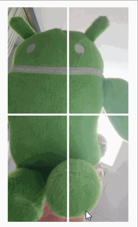

<h2>Scale Type Explorer (For Android ImageView)</h2>

This is an expanded source project for the demo app shown in
[this answer](https://stackoverflow.com/a/54278884/6287910)  to
[this Stack Overflow question](https://stackoverflow.com/questions/54216273/how-to-have-similar-mechanism-of-center-crop-on-exoplayers-playerview-but-not).
The default behavior of this demo app duplicates what is presented in that answer.

<h4>What This Demo Does</h4>

The purpose of this demo is to show how various [scale types](https://developer.android.com/reference/android/widget/ImageView.ScaleType) effect an
image that is placed within an [_ImageView_](https://developer.android.com/reference/android/widget/ImageView). The goal is to fit a 1080x1920 pixel JPEG image into an _ImageView_ with scaling and
cropping that is specified by one of the scale types selected from the
options menu.  The image can be made smaller by dragging it up or left and
larger by dragging it down or right. As the view size changes, the image
fills the allotted area according to the rules of each scale type.

A special interpretation is made for the scale type "MATRIX" as explained below.

<h4><u>Matrix: Center Crop versus Off-center Crop</u></h4>

The matrix scale type is implemented to behave like
[ImageView.ScaleType.CENTER_CROP](https://developer.android.com/reference/android/widget/ImageView.ScaleType)
but with a focal point for the scaling and cropping that can be independently set as a
percentage from the top and left sides of the image.

Center crop has a focal point that is located at 1/2 the width and 1/2
the height of the image as shown below. White lines mark the vertical
and horizontal center lines. With a scale type of center crop, the image is always sized such that
the width and/or the height fits precisely within the _ImageView_. The
image will completely fill the view. As the image changes size, notice
how the image collapses around the center.

Now let's move to a focal point that is 20% of the image height from
the top of the image and 20% from the left edge. In the following
image, blue lines mark the new focus (here 20%/20%) on the image while
red lines mark the same point on the _ImageView_. As before, white lines
mark the centers.

As the _ImageView_ shrinks, the image collapses around the point that
is 20% from the top and 20% from the left side. The width and/or
height fits precisely within the _ImageView_ As with center crop, gaps
between the image and the _ImageView_ are not permitted. These percentage
can be selected through the options menu.